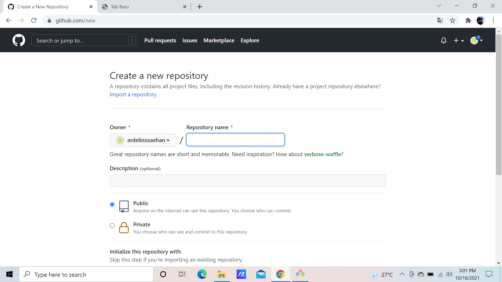
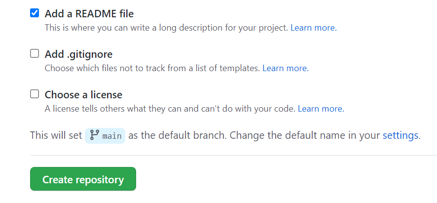
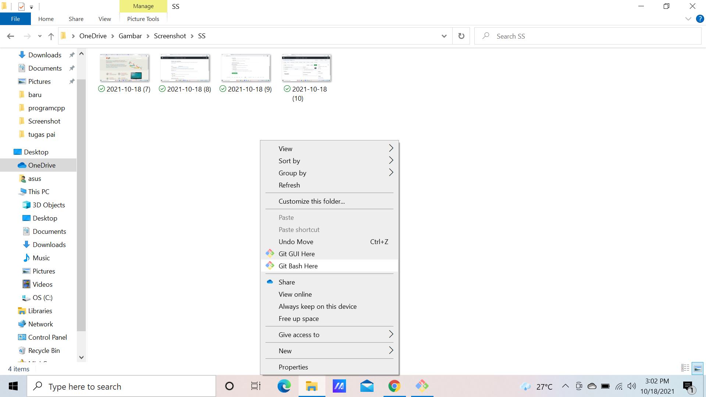
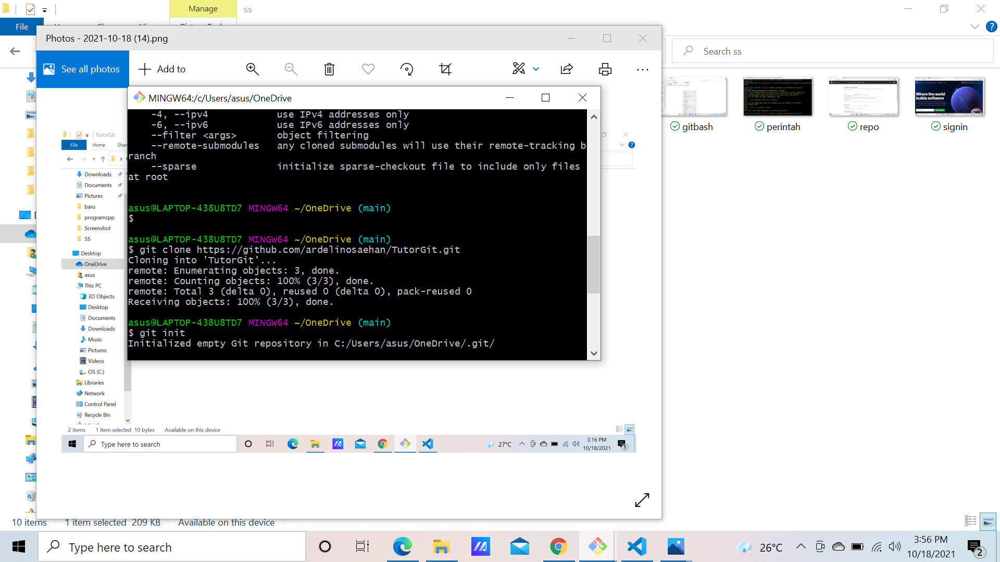

# TutorGit

Download Git terlebih dahulu

Jika sudah mendownload Git
Masuk ke github.com
lalu Login,jika belum mempunyai akun Github silahkan mendaftar

Kalo sudah mendaftar klik create repository

Isi nama repository nya
lalu centang Add a README File

Lalu klik Create repository

Lalu klik Code dan copy link github

Lalu ke folder dan klik kanan lalu pilih Git bash Here

Kemudian clone link tersebut dengan perintah
git clone (paste link tersebut)

Setelah di clone,kemudian masukan file yang ingin di upload
ke repository, setelah itu
Ketikan perintah tersebut

1.git branch -M main
(untuk merubah posisi branch ke main)
2. git init
(untuk membuat repository baru)
3. git add namafile
(untuk menambahkan file yang ingin di upoload)
4. git commit -m "first commit"
(untuk menambahkan commit)
5. git config --global user.email "youremail"
(masukan email github anda untuk mengupoload repository)
6. git push -u origin main
(untuk mengupload repository)
 

 Kemudian refresh browser GitHub Anda

 SELESAI 